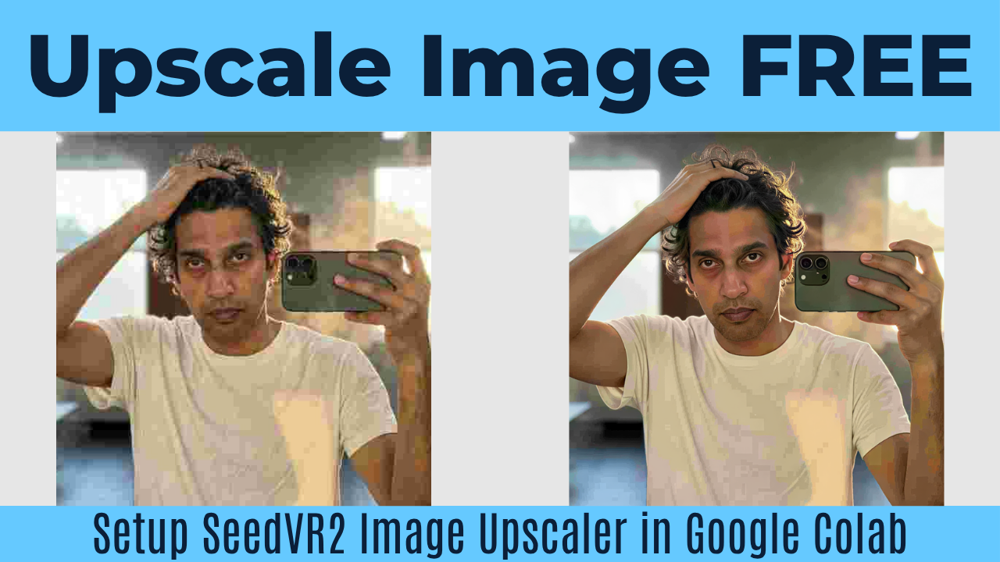

# ⚡ SeedVR2 Image Upscaler in Google Colab

This repository contains an easy-to-use Google Colab notebook for running the **SeedVR2 Image Upscaler**. Powered by ComfyUI, this tool allows you to take any image and upscale it to a stunning high resolution using the SeedVR2 DiT (3B) model, entirely for free.

**🎥 Watch the Tutorial:** [Setup SeedVR2 Image Upscaler in Google Colab](https://www.youtube.com/watch?v=uejQAq8Qyvg)

**🚀 Run in Colab:** [Open Google Colab Notebook](https://colab.research.google.com/drive/1HnZDK63Q8dlaDGmfxW7VLauAJINE_a-V?usp=sharing)

---

## ✨ Features Supported in this Notebook

This notebook automates the upscaling process into 3 simple steps:

1. **⚙️ Initialize Core Environment**: Automatically clones ComfyUI and installs the custom SeedVR2 Processing Nodes.
2. **📥 High-Speed Asset Downloader**: Uses Aria2c to rapidly download the SeedVR2 DiT (3B) and VAE models in the background.
3. **🖼️ SeedVR2 Image Upscaler**: The core upscaling engine. Features include:
   * **Source Image Upload**: A built-in prompt allows you to upload your image directly into the Colab environment.
   * **Upscale Factor**: A slider to multiply the shortest edge of your image by 1.0x up to 4.0x.
   * **Color Correction**: Options to apply `lab` color correction or `none`.
   * **Upscale Alpha**: Built-in support for upscaling images with transparency (RGBA formats).
   * **Noise Controls**: Fine-tune the `INPUT_NOISE_SCALE` and `LATENT_NOISE_SCALE`.
   * **Auto-download**: Automatically downloads the final high-resolution image directly to your computer.

## 🛠️ How to Use

1. Click the "Open in Colab" badge above.
2. Go to **Runtime > Change runtime type** and ensure a **T4 GPU** is selected.
3. Run **Cell 1** to initialize the environment and install dependencies.
4. Run **Cell 2** to download the required DiT and VAE models. 
5. Go to **Cell 3**. 
   * Ensure `UPLOAD_INPUT_IMAGE` is checked.
   * Adjust your `UPSCALE_FACTOR` and other settings as desired.
   * Hit the Play button and upload your image when prompted.
   * The server will process your image, display a preview, and automatically download the upscaled version!

## 🤝 Credits
* **Notebook Creator:** [@CoinNoin](https://www.youtube.com/@CoinNoin)
* **SeedVR2 Nodes:** [numz / ComfyUI-SeedVR2_VideoUpscaler](https://github.com/numz/ComfyUI-SeedVR2_VideoUpscaler)
